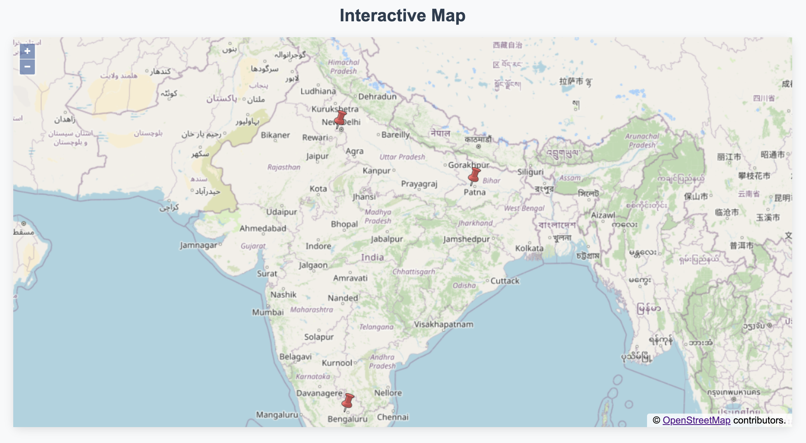
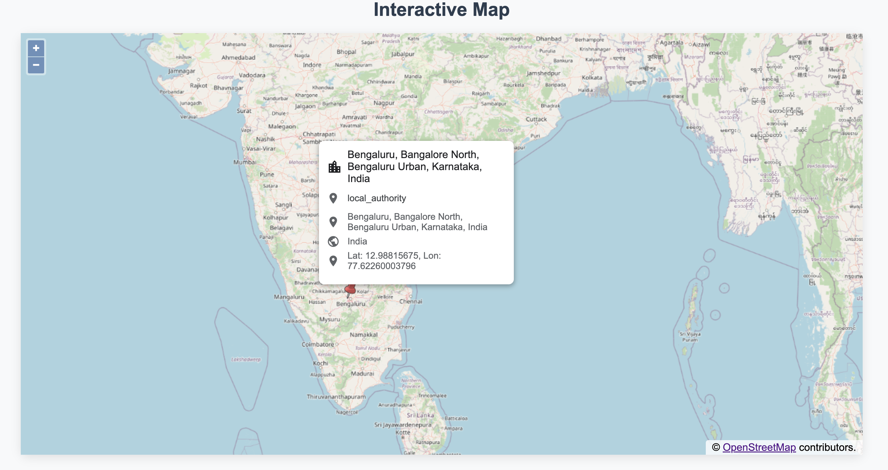

# Interactive Map Application

This project is an object-oriented JavaScript application that displays interactive maps with location markers and popups. The application uses OpenLayers for map rendering and OpenStreetMap's Nominatim service for geocoding.



## Class Structure

### 1. LocationService

A static utility class that handles location data retrieval.

- **Methods**:
  - `getLocationData(searchQuery)`: Fetches location data based on search query
  - `getLocationDataByCoordinates(coordinates)`: Fetches location data based on coordinates

### 2. MapMarker

Handles the creation and styling of map markers.

- **Properties**:
  - `feature`: OpenLayers feature for the marker
- **Methods**:
  - `setStyle()`: Sets the visual style of the marker
  - `getFeature()`: Returns the marker feature

### 3. PopupOverlay

Manages the popup overlays that appear when clicking markers.



- **Properties**:
  - `overlay`: OpenLayers overlay instance
- **Methods**:
  - `setPosition(coordinates)`: Updates popup position
  - `getOverlay()`: Returns the overlay instance
  - `updateContent(coordinates, element)`: Updates popup content with location data
  - `generatePopupContent(location)`: Generates HTML content for location data
  - `generateErrorContent()`: Generates HTML content for error states
  - `setPopupContent(content, element)`: Sets the popup's HTML content

### 4. MapManager

Manages a single-location map instance.

- **Properties**:
  - `targetElement`: DOM element for map rendering
  - `map`: OpenLayers map instance
  - `popup`: PopupOverlay instance
  - `marker`: MapMarker instance
- **Methods**:
  - `initialize(searchQuery)`: Initializes the map with a location
  - `initializeMap(coordinates)`: Sets up the map instance
  - `addMarker(coordinates)`: Adds a marker to the map
  - `setupPopup()`: Initializes the popup overlay
  - `setupEventListeners()`: Sets up map interaction events
  - `handleMapClick(evt)`: Handles marker click events
  - `handlePointerMove(e)`: Handles pointer movement events

### 5. MultiCityMapManager

Extends map functionality to handle multiple cities.

- **Properties**:
  - `targetElement`: DOM element for map rendering
  - `map`: OpenLayers map instance
  - `popup`: PopupOverlay instance
  - `markers`: Map of marker features and their associated data
- **Methods**:
  - `initialize(cities)`: Initializes the map with multiple cities
  - `addCityMarkers(cities)`: Adds markers for multiple cities
  - `initializeMap(coordinates)`: Sets up the map instance
  - `setupPopup()`: Initializes the popup overlay
  - `setupEventListeners()`: Sets up map interaction events
  - `handleMapClick(evt)`: Handles marker click events
  - `handlePointerMove(e)`: Handles pointer movement events

## Class Relationships

- `MultiCityMapManager` and `MapManager` are the main controller classes
- Both managers use `LocationService` for data fetching
- Both managers create instances of `MapMarker` for each location
- Both managers use `PopupOverlay` for displaying location information
- `MultiCityMapManager` extends the functionality of `MapManager` to handle multiple locations

## Usage

### Single Location Map

```javascript
const mapManager = new MapManager(document.getElementById('map'));
mapManager.initialize('New York, USA');
```

### Multiple Cities Map

```javascript
const cities = ['New York, USA', 'Los Angeles, USA', 'Chicago, USA'];
const multiCityMapManager = new MultiCityMapManager(document.getElementById('map'));
multiCityMapManager.initialize(cities);
```

## Error Handling

- If the location data is not found, the application will display an error message.
- If the coordinates are not found, the application will display an error message.
- If the map is not found, the application will display an error message.

## Dependencies

- OpenLayers (ol)
- OpenStreetMap's Nominatim service
